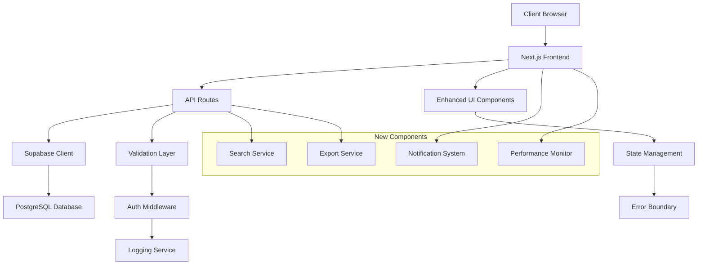

# Design Document

## Overview

청람보드 시스템 개선 프로젝트는 현재 Next.js 기반의 보드게임 대여 관리 시스템을 사용성, 성능, 보안 측면에서 향상시키는 것을 목표로 합니다. 이 설계는 기존 Supabase 백엔드와 React 프론트엔드 구조를 유지하면서 점진적인 개선을 통해 시스템 품질을 향상시킵니다.

## Architecture

### Current Architecture Analysis
- **Frontend**: Next.js 15 with React 19, TypeScript
- **Backend**: Supabase (PostgreSQL + Auth + Real-time)
- **Styling**: Tailwind CSS with Radix UI components
- **Deployment**: Cloudflare Workers (OpenNext)

### Improved Architecture Components



## Components and Interfaces

### 1. Enhanced UI Components

#### GameCard Component Improvements
```typescript
interface EnhancedGameCard {
  game: Game;
  isAdmin: boolean;
  onRent?: (gameId: number) => void;
  onFavorite?: (gameId: number) => void;
  showDetailedInfo?: boolean;
}
```

**Features:**
- Improved visual feedback with hover states
- Loading states for async operations
- Better accessibility with ARIA labels
- Responsive design optimizations

#### SearchAndFilter Component
```typescript
interface SearchFilterProps {
  onSearch: (query: string) => void;
  onFilter: (filters: GameFilters) => void;
  availableFilters: FilterOptions;
  currentFilters: GameFilters;
}

interface GameFilters {
  playerCount?: { min: number; max: number };
  playTime?: { min: number; max: number };
  availability?: 'available' | 'rented' | 'all';
  category?: string[];
}
```

#### Enhanced Tables
```typescript
interface EnhancedTableProps<T> {
  data: T[];
  columns: TableColumn<T>[];
  pagination?: PaginationConfig;
  sorting?: SortingConfig;
  selection?: SelectionConfig;
  loading?: boolean;
  error?: string;
}
```

### 2. State Management Layer

#### Global State Structure
```typescript
interface AppState {
  games: {
    items: Game[];
    loading: boolean;
    error: string | null;
    filters: GameFilters;
    searchQuery: string;
  };
  rentals: {
    items: Rental[];
    loading: boolean;
    error: string | null;
  };
  ui: {
    notifications: Notification[];
    modals: ModalState;
    theme: ThemeConfig;
  };
  user: {
    profile: UserProfile | null;
    isAdmin: boolean;
    loading: boolean;
  };
}
```

### 3. API Layer Enhancements

#### Validation Middleware
```typescript
interface ValidationConfig {
  schema: ZodSchema;
  sanitize?: boolean;
  customValidators?: CustomValidator[];
}

interface APIResponse<T> {
  data?: T;
  error?: {
    message: string;
    code: string;
    details?: any;
  };
  meta?: {
    pagination?: PaginationMeta;
    timestamp: string;
  };
}
```

#### Enhanced API Routes
- `/api/games` - Enhanced with search, filtering, pagination
- `/api/rentals` - Improved validation and error handling
- `/api/admin/analytics` - New analytics endpoint
- `/api/export` - Data export functionality

### 4. Performance Optimization Components

#### Image Optimization Service
```typescript
interface ImageOptimizationConfig {
  sizes: number[];
  formats: ('webp' | 'avif' | 'jpeg')[];
  quality: number;
  lazy: boolean;
}
```

#### Caching Strategy
- **Client-side**: React Query for API response caching
- **Server-side**: Next.js ISR for static content
- **Database**: Supabase built-in caching with custom cache keys

## Data Models

### Enhanced Game Model
```typescript
interface Game {
  id: number;
  title: string;
  description?: string;
  image_url: string;
  koreaboardgames_url: string;
  min_players: number;
  max_players: number;
  play_time: number;
  complexity?: number; // 1-5 scale
  categories?: string[];
  created_at: string;
  updated_at: string;
  
  // Computed fields
  is_rented: boolean;
  due_date?: string;
  rental_count?: number;
  average_rating?: number;
}
```

### Enhanced Rental Model
```typescript
interface Rental {
  id: number;
  game_id: number;
  name: string;
  email?: string;
  phone?: string;
  rented_at: string;
  due_date: string;
  returned_at?: string;
  extended_count: number;
  notes?: string;
  created_at: string;
  updated_at: string;
  
  // Relations
  game: Game;
}
```

### User Profile Model
```typescript
interface UserProfile {
  id: string;
  email: string;
  name?: string;
  is_admin: boolean;
  preferences: {
    theme: 'light' | 'dark' | 'system';
    language: 'ko' | 'en';
    notifications: NotificationPreferences;
  };
  created_at: string;
  last_login: string;
}
```

## Error Handling

### Error Boundary Implementation
```typescript
interface ErrorBoundaryState {
  hasError: boolean;
  error?: Error;
  errorInfo?: ErrorInfo;
}

class EnhancedErrorBoundary extends Component<Props, ErrorBoundaryState> {
  // Comprehensive error logging and user-friendly error display
}
```

### API Error Handling Strategy
1. **Client-side validation** before API calls
2. **Server-side validation** with detailed error responses
3. **Graceful degradation** for non-critical failures
4. **Retry mechanisms** for transient errors
5. **User-friendly error messages** with actionable suggestions

### Error Categories
- **Validation Errors**: Input validation failures
- **Authentication Errors**: Auth token issues
- **Authorization Errors**: Permission denied
- **Network Errors**: Connection issues
- **Server Errors**: Internal server problems
- **Business Logic Errors**: Application-specific errors

## Testing Strategy

### Unit Testing
- **Components**: React Testing Library for UI components
- **Utilities**: Jest for utility functions
- **API Routes**: Supertest for API endpoint testing
- **Validation**: Schema validation testing

### Integration Testing
- **API Integration**: Full API workflow testing
- **Database Integration**: Supabase client testing
- **Authentication Flow**: Auth integration testing

### End-to-End Testing
- **User Workflows**: Critical user journey testing
- **Admin Functions**: Administrative task testing
- **Cross-browser**: Multi-browser compatibility

### Performance Testing
- **Load Testing**: API endpoint performance
- **Bundle Analysis**: JavaScript bundle optimization
- **Core Web Vitals**: Frontend performance metrics

## Security Enhancements

### Authentication & Authorization
```typescript
interface SecurityConfig {
  sessionTimeout: number;
  maxLoginAttempts: number;
  passwordPolicy: PasswordPolicy;
  adminVerification: AdminVerificationConfig;
}
```

### Input Sanitization
- **XSS Prevention**: HTML sanitization for user inputs
- **SQL Injection**: Parameterized queries (handled by Supabase)
- **CSRF Protection**: Token-based CSRF protection
- **Rate Limiting**: API endpoint rate limiting

### Data Protection
- **Sensitive Data**: Encryption for sensitive information
- **Audit Logging**: Admin action logging
- **Data Validation**: Comprehensive input validation
- **Access Control**: Role-based access control

## Performance Optimizations

### Frontend Optimizations
1. **Code Splitting**: Route-based and component-based splitting
2. **Image Optimization**: Next.js Image component with optimization
3. **Bundle Optimization**: Tree shaking and dead code elimination
4. **Caching Strategy**: Aggressive caching for static assets

### Backend Optimizations
1. **Database Indexing**: Optimized database queries
2. **API Response Caching**: Redis-like caching for frequent queries
3. **Pagination**: Efficient data pagination
4. **Connection Pooling**: Database connection optimization

### Monitoring and Analytics
```typescript
interface PerformanceMetrics {
  pageLoadTime: number;
  apiResponseTime: number;
  errorRate: number;
  userEngagement: EngagementMetrics;
}
```

## Mobile Responsiveness

### Responsive Design Strategy
1. **Mobile-First Approach**: Design for mobile, enhance for desktop
2. **Flexible Grid System**: CSS Grid and Flexbox for layouts
3. **Touch-Friendly Interface**: Appropriate touch targets
4. **Progressive Enhancement**: Core functionality on all devices

### Mobile-Specific Features
- **Swipe Gestures**: For table navigation
- **Pull-to-Refresh**: For data updates
- **Offline Support**: Basic offline functionality
- **App-like Experience**: PWA capabilities

## Notification System

### Notification Types
```typescript
interface Notification {
  id: string;
  type: 'success' | 'error' | 'warning' | 'info';
  title: string;
  message: string;
  duration?: number;
  actions?: NotificationAction[];
  persistent?: boolean;
}
```

### Delivery Mechanisms
1. **In-App Notifications**: Toast notifications
2. **Email Notifications**: For important events
3. **Browser Notifications**: For real-time updates
4. **Admin Alerts**: For system issues

## Export and Reporting

### Export Formats
- **CSV**: Basic data export
- **Excel**: Enhanced formatting and multiple sheets
- **PDF**: Formatted reports with charts
- **JSON**: API data export

### Report Types
1. **Usage Reports**: Game rental statistics
2. **Inventory Reports**: Game availability and condition
3. **User Reports**: User activity and preferences
4. **Financial Reports**: Revenue and cost analysis

## Migration Strategy

### Phase 1: Foundation (Weeks 1-2)
- Enhanced error handling and validation
- Improved UI components
- Basic performance optimizations

### Phase 2: Features (Weeks 3-4)
- Search and filtering functionality
- Enhanced admin features
- Notification system

### Phase 3: Advanced (Weeks 5-6)
- Analytics and reporting
- Mobile optimizations
- Security enhancements

### Phase 4: Polish (Weeks 7-8)
- Performance fine-tuning
- Testing and bug fixes
- Documentation and deployment