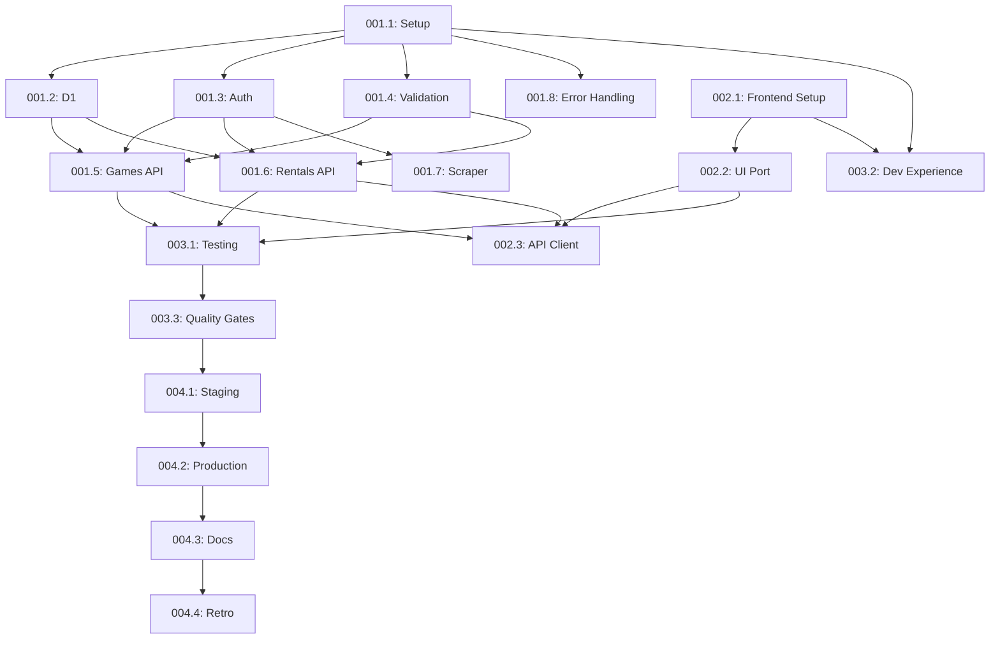

# Migration Plan: OpenNext to Pure Cloudflare Workers

```yaml
trace: SPEC-migration-workers-1
status: draft
created: 2025-11-06
total_effort: 9.0 person-days
elapsed_time: 5-7 calendar days (with parallelization)
priority: high
```

---

## Overview

Migrate from Next.js + OpenNext to **Pure Cloudflare Workers** architecture:
- **Backend**: Hono on Workers
- **Frontend**: Static React on Pages
- **No downtime concerns** (no existing data/users)

**Key Metrics**:
- **Total Effort**: 9.0 person-days (sum of all task efforts)
- **Elapsed Time**: 5-7 calendar days (with parallel execution)
- **Team Size**: Assumes 2-3 people working in parallel

---

## Effort vs. Timeline Clarification

**Total Effort** (Person-Days): Sum of all individual task efforts
- Backend: 5.5 person-days
- Frontend: 2.0 person-days
- Testing: 1.5 person-days
- Deployment: 2.0 person-days
- **Total**: **11.0 person-days**

**Elapsed Time** (Calendar Days): Actual duration with parallel work
- Phase 1 + 2 can run in parallel (Backend team + Frontend team)
- Phase 3 depends on Phase 1 + 2 completion
- Phase 4 is sequential
- **With 2-3 people**: **5-7 calendar days**

---

## Task Breakdown

### Phase 1: Backend Migration (Days 1-3, 5.5 person-days)

#### TASK-workers-001.1: Project Setup & Structure
**Trace**: SPEC-migration-workers-1 → TASK-workers-001 → TASK-workers-001.1
**Effort**: 0.5 person-days
**Priority**: Critical
**Status**: Pending
**Owner**: Backend Team

**Objectives**:
- [ ] Create `workers/` directory for Worker backend
- [ ] Initialize Hono project with TypeScript
- [ ] Set up `wrangler.toml` configuration
- [ ] Configure D1 binding
- [ ] Set up test infrastructure (Vitest)

**Deliverables**:
```
workers/
  src/
    index.ts           # Empty Hono app
  wrangler.toml        # D1 + env configured
  tsconfig.json
  package.json
  vitest.config.ts
```

**Definition of Done**:
- [ ] `npm run dev` starts Worker locally
- [ ] D1 binding accessible
- [ ] Basic health check endpoint returns 200
- [ ] Tests run successfully (even if empty)
- [ ] Quality gate: Lint passing

**Dependencies**: None

---

#### TASK-workers-001.2: Port D1 Adapter
**Trace**: SPEC-migration-workers-1 → TASK-workers-001 → TASK-workers-001.2
**Effort**: 0.5 person-days
**Priority**: Critical
**Status**: Pending
**Owner**: Backend Team

**Objectives**:
- [ ] Copy `src/lib/db/` to `workers/src/lib/db/`
- [ ] Remove OpenNext-specific code (Symbol hacks)
- [ ] Simplify D1 instance access (direct from env)
- [ ] Update type imports for Workers
- [ ] Test all adapter methods

**Changes Required**:
```typescript
// OLD (src/utils/d1/server.ts)
const cloudflareContext = (globalThis as any)[Symbol.for('__cloudflare-context__')];
const db = cloudflareContext.env?.DB;

// NEW (workers/src/lib/db/adapter.ts)
export class D1Adapter {
  constructor(private db: D1Database) {}
  // Use this.db directly
}
```

**Definition of Done**:
- [ ] All CRUD methods work (Games + Rentals)
- [ ] Unit tests passing (≥80% coverage)
- [ ] No Symbol hacks
- [ ] TypeScript errors resolved
- [ ] Quality gate: Type safety passing

**Dependencies**: TASK-workers-001.1

---

#### TASK-workers-001.3: Auth Middleware
**Trace**: SPEC-migration-workers-1 → TASK-workers-001 → TASK-workers-001.3
**Effort**: 0.5 person-days
**Priority**: Critical
**Status**: Pending
**Owner**: Backend Team

**Objectives**:
- [ ] Create Hono auth middleware
- [ ] Extract email from headers (CF-Access or X-Dev)
- [ ] Check against `env.ADMIN_EMAILS` (direct access, no Symbol hack)
- [ ] Return 401/403 appropriately

**Implementation**:
```typescript
// workers/src/middleware/auth.ts
import { Context, Next } from 'hono'
import { Env } from '../types/env'

export async function requireAdmin(c: Context<{ Bindings: Env }>, next: Next) {
  const email =
    c.req.header('CF-Access-Authenticated-User-Email') ||
    (c.env.NODE_ENV === 'development' ? c.req.header('X-Dev-User-Email') : null)

  if (!email) {
    return c.json({ error: { code: 'UNAUTHORIZED', message: '...' }}, 401)
  }

  const adminEmails = c.env.ADMIN_EMAILS.split(',').map(e => e.trim().toLowerCase())
  if (!adminEmails.includes(email.toLowerCase())) {
    return c.json({ error: { code: 'FORBIDDEN', message: '...' }}, 403)
  }

  c.set('userEmail', email)
  await next()
}
```

**Definition of Done**:
- [ ] Valid admin passes through
- [ ] Invalid email returns 403
- [ ] Missing email returns 401
- [ ] Dev mode works with X-Dev-User-Email
- [ ] Tests cover all cases (≥80% coverage)
- [ ] Quality gate: Security scan passing

**Dependencies**: TASK-workers-001.1

---

#### TASK-workers-001.4: Validation Middleware
**Trace**: SPEC-migration-workers-1 → TASK-workers-001 → TASK-workers-001.4
**Effort**: 0.5 person-days
**Priority**: High
**Status**: Pending
**Owner**: Backend Team

**Objectives**:
- [ ] Port Zod schemas from `src/lib/validation/`
- [ ] Create Hono validation middleware
- [ ] Support body, query, params validation
- [ ] Return structured error responses

**Implementation**:
```typescript
// workers/src/middleware/validation.ts
import { z } from 'zod'
import { Context } from 'hono'
import { validator } from 'hono/validator'

export const validateBody = <T extends z.ZodType>(schema: T) =>
  validator('json', (value, c) => {
    const result = schema.safeParse(value)
    if (!result.success) {
      return c.json({
        error: {
          code: 'VALIDATION_ERROR',
          message: 'Invalid request body',
          details: result.error.flatten()
        }
      }, 400)
    }
    return result.data
  })
```

**Definition of Done**:
- [ ] All existing Zod schemas ported
- [ ] Body validation works
- [ ] Query validation works
- [ ] Error format matches spec
- [ ] Tests passing (≥80% coverage)
- [ ] Quality gate: Lint passing

**Dependencies**: TASK-workers-001.1

---

#### TASK-workers-001.5: Games API Routes
**Trace**: SPEC-migration-workers-1 → TASK-workers-001 → TASK-workers-001.5
**Effort**: 1.0 person-days
**Priority**: High
**Status**: Pending
**Owner**: Backend Team

**Objectives**:
- [ ] Implement 5 Games endpoints in Hono
- [ ] Apply auth middleware where needed
- [ ] Validate request bodies
- [ ] Use D1Adapter for DB operations
- [ ] Return correct status codes (200, 201, 204)

**Endpoints**:
- GET /api/games (public)
- POST /api/games (admin)
- GET /api/games/:id (public)
- PUT /api/games/:id (admin)
- DELETE /api/games/:id (admin)

**Definition of Done**:
- [ ] All 5 endpoints implemented
- [ ] Tests passing (match existing test cases, ≥80% coverage)
- [ ] Admin-only endpoints protected
- [ ] Response format matches spec
- [ ] Error handling works
- [ ] Quality gates: Lint + Type safety passing

**Dependencies**: TASK-workers-001.2, TASK-workers-001.3, TASK-workers-001.4

---

#### TASK-workers-001.6: Rentals API Routes
**Trace**: SPEC-migration-workers-1 → TASK-workers-001 → TASK-workers-001.6
**Effort**: 1.0 person-days
**Priority**: High
**Status**: Pending
**Owner**: Backend Team

**Objectives**:
- [ ] Implement 7 Rentals endpoints
- [ ] Apply auth middleware
- [ ] Validate request bodies
- [ ] Use D1Adapter for DB operations
- [ ] Handle rental-specific logic (return, extend)
- [ ] **Fix 500 errors** from OpenNext version

**Endpoints**:
- GET /api/rentals
- POST /api/rentals
- GET /api/rentals/:id
- PUT /api/rentals/:id
- DELETE /api/rentals/:id
- POST /api/rentals/:id/return
- POST /api/rentals/:id/extend

**Definition of Done**:
- [ ] All 7 endpoints implemented
- [ ] Tests passing (≥80% coverage)
- [ ] Business logic preserved
- [ ] Error handling works
- [ ] 500 errors resolved
- [ ] Quality gates: Lint + Type safety passing

**Dependencies**: TASK-workers-001.2, TASK-workers-001.3, TASK-workers-001.4

---

#### TASK-workers-001.7: Scraper API Route
**Trace**: SPEC-migration-workers-1 → TASK-workers-001 → TASK-workers-001.7
**Effort**: 0.5 person-days
**Priority**: Low
**Status**: Pending
**Owner**: Backend Team

**Objectives**:
- [ ] Port scraper logic from `src/app/api/scrape/`
- [ ] Ensure Cheerio works in Workers
- [ ] Apply admin auth
- [ ] Test with real URLs

**Definition of Done**:
- [ ] POST /api/scrape works
- [ ] Cheerio scraping functional
- [ ] Error handling for network issues
- [ ] Tests passing (≥80% coverage)
- [ ] Quality gate: Security scan passing (XSS prevention)

**Dependencies**: TASK-workers-001.3

---

#### TASK-workers-001.8: Error Handling & Logging
**Trace**: SPEC-migration-workers-1 → TASK-workers-001 → TASK-workers-001.8
**Effort**: 1.0 person-days
**Priority**: Medium
**Status**: Pending
**Owner**: Backend Team

**Objectives**:
- [ ] Create error handler middleware
- [ ] Simplify logging for Workers (no filesystem)
- [ ] Use `console.log` + Cloudflare Logs
- [ ] Preserve structured logging format
- [ ] Add request correlation IDs

**Implementation**:
```typescript
// workers/src/middleware/error-handler.ts
export async function errorHandler(err: Error, c: Context) {
  console.error('API Error:', {
    error: err.message,
    stack: err.stack,
    path: c.req.path,
    method: c.req.method,
    timestamp: new Date().toISOString()
  })

  return c.json({
    error: {
      code: 'INTERNAL_ERROR',
      message: err.message,
      timestamp: new Date().toISOString()
    }
  }, 500)
}
```

**Definition of Done**:
- [ ] Global error handler catches all errors
- [ ] Logs structured JSON to console
- [ ] Request correlation works
- [ ] No sensitive data in logs
- [ ] Tests passing (≥80% coverage)
- [ ] Quality gate: Security scan passing

**Dependencies**: TASK-workers-001.1

---

### Phase 2: Frontend Extraction (Days 1-3 parallel, 2.0 person-days)

#### TASK-workers-002.1: Frontend Project Setup
**Trace**: SPEC-migration-workers-1 → TASK-workers-002 → TASK-workers-002.1
**Effort**: 0.5 person-days
**Priority**: High
**Status**: Pending
**Owner**: Frontend Team

**Objectives**:
- [ ] Create `frontend/` directory
- [ ] Initialize Vite + React + TypeScript
- [ ] Configure Tailwind CSS
- [ ] Set up React Router
- [ ] Configure API base URL

**Deliverables**:
```
frontend/
  src/
    main.tsx
    App.tsx
  index.html
  vite.config.ts
  tailwind.config.ts
  package.json
```

**Definition of Done**:
- [ ] `npm run dev` starts frontend
- [ ] Tailwind CSS working
- [ ] React Router configured
- [ ] API base URL configurable via env
- [ ] Production build works
- [ ] Quality gates: Lint + Type safety passing

**Dependencies**: None (parallel with Phase 1)

---

#### TASK-workers-002.2: Port UI Components
**Trace**: SPEC-migration-workers-1 → TASK-workers-002 → TASK-workers-002.2
**Effort**: 1.0 person-days
**Priority**: High
**Status**: Pending
**Owner**: Frontend Team

**Objectives**:
- [ ] Copy 19 components from `src/components/`
- [ ] Copy 4 pages from `src/app/`
- [ ] Update imports (no Next.js dependencies)
- [ ] Replace `next/link` with React Router `Link`
- [ ] Replace `next/image` with standard ``

**Components to Port**:
- UI components (buttons, cards, modals, etc.) - 19 total
- Pages: Home, Admin, Admin/Games, Admin/Rentals - 4 total

**Definition of Done**:
- [ ] All components render correctly
- [ ] No Next.js imports remaining
- [ ] React Router navigation works
- [ ] Styling preserved
- [ ] TypeScript errors resolved
- [ ] Quality gates: Lint + Type safety passing

**Dependencies**: TASK-workers-002.1

---

#### TASK-workers-002.3: API Client Integration
**Trace**: SPEC-migration-workers-1 → TASK-workers-002 → TASK-workers-002.3
**Effort**: 0.5 person-days
**Priority**: High
**Status**: Pending
**Owner**: Frontend Team

**Objectives**:
- [ ] Create API client using fetch or axios
- [ ] Set up React Query for data fetching
- [ ] Handle authentication headers
- [ ] Error handling and toasts
- [ ] Loading states

**Implementation**:
```typescript
// frontend/src/lib/api-client.ts
const API_BASE = import.meta.env.VITE_API_BASE_URL

export async function apiCall(endpoint: string, options?: RequestInit) {
  const response = await fetch(`${API_BASE}${endpoint}`, {
    ...options,
    headers: {
      'Content-Type': 'application/json',
      'X-Dev-User-Email': localStorage.getItem('devEmail') || '',
      ...options?.headers
    }
  })

  if (!response.ok) {
    const error = await response.json()
    throw new Error(error.error.message)
  }

  return response.json()
}
```

**Definition of Done**:
- [ ] API calls work to Worker backend
- [ ] React Query setup complete
- [ ] Error handling with toasts
- [ ] Loading states work
- [ ] Auth headers included
- [ ] Quality gates: Lint + Type safety passing

**Dependencies**: TASK-workers-002.1, TASK-workers-001.5, TASK-workers-001.6

---

### Phase 3: Testing & Integration (Day 4-5, 1.5 person-days)

#### TASK-workers-003.1: Update Test Suite
**Trace**: SPEC-migration-workers-1 → TASK-workers-003 → TASK-workers-003.1
**Effort**: 1.0 person-days
**Priority**: Critical
**Status**: Pending
**Owner**: QA Team

**Objectives**:
- [ ] Port existing tests to Worker format
- [ ] Update test scripts in `.spec/migration/testing/`
- [ ] Test against local Worker (not OpenNext)
- [ ] Add E2E tests for frontend
- [ ] Ensure coverage ≥80%

**Test Categories**:
- API unit tests (Vitest)
- Integration tests (API + D1)
- E2E tests (Playwright for frontend)

**Definition of Done**:
- [ ] All 29 API tests passing
- [ ] Coverage ≥80% lines, ≥70% branches
- [ ] E2E tests for critical flows
- [ ] Test scripts updated
- [ ] CI/CD config updated
- [ ] Quality gate: Test coverage passing

**Dependencies**: TASK-workers-001.5, TASK-workers-001.6, TASK-workers-002.2

---

#### TASK-workers-003.2: Local Development Experience
**Trace**: SPEC-migration-workers-1 → TASK-workers-003 → TASK-workers-003.2
**Effort**: 0.5 person-days
**Priority**: Medium
**Status**: Pending
**Owner**: DevOps Team

**Objectives**:
- [ ] Create `npm run dev` script (runs both Worker + Frontend)
- [ ] Configure CORS for local dev
- [ ] Update `.dev.vars` for Worker
- [ ] Update `.env` for Frontend
- [ ] Document dev workflow

**Scripts**:
```json
// Root package.json
{
  "scripts": {
    "dev": "concurrently \"npm run dev:worker\" \"npm run dev:frontend\"",
    "dev:worker": "cd workers && npm run dev",
    "dev:frontend": "cd frontend && npm run dev"
  }
}
```

**Definition of Done**:
- [ ] Single command starts both services
- [ ] Hot reload works for both
- [ ] CORS configured correctly
- [ ] Dev documentation updated
- [ ] Quality gate: Local build passes

**Dependencies**: TASK-workers-001.1, TASK-workers-002.1

---

#### TASK-workers-003.3: Quality Gates Validation
**Trace**: SPEC-migration-workers-1 → TASK-workers-003 → TASK-workers-003.3
**Effort**: 0.5 person-days
**Priority**: Critical
**Status**: Pending
**Owner**: QA Team

**Objectives**:
- [ ] Run all quality gate checks
- [ ] Fix any issues found
- [ ] Document gate results
- [ ] Prepare for deployment

**Quality Gates to Validate**:
1. **Test Coverage**: Lines ≥80%, Branches ≥70%
   ```bash
   npm run test:coverage
   ```

2. **Type Safety**: Zero TypeScript errors
   ```bash
   npm run type-check  # tsc --noEmit
   ```

3. **Linting**: Zero errors/warnings
   ```bash
   npm run lint
   npm run format:check
   ```

4. **Security Scan**: Zero critical/high vulnerabilities
   ```bash
   npm audit --audit-level=moderate
   ```

5. **License Scan**: All licenses compatible
   ```bash
   npx license-checker --production --failOn 'GPL;AGPL'
   ```

6. **Performance Regression**: Bundle size checks
   ```bash
   # Worker bundle
   wrangler deploy --dry-run
   du -sh workers/.open-next/worker.js  # Must be ≤100KB

   # Frontend bundle
   npm run build --prefix frontend
   du -sh frontend/dist  # Must be ≤500KB
   ```

**Definition of Done**:
- [ ] All 6 gates passing
- [ ] Gate results documented
- [ ] Any issues fixed or documented
- [ ] Ready for staging deployment

**Dependencies**: TASK-workers-003.1

---

### Phase 4: Deployment & Finalization (Days 6-7, 2.0 person-days)

#### TASK-workers-004.1: Staging Deployment
**Trace**: SPEC-migration-workers-1 → TASK-workers-004 → TASK-workers-004.1
**Effort**: 0.5 person-days
**Priority**: High
**Status**: Pending
**Owner**: DevOps Team

**Objectives**:
- [ ] Deploy Worker to staging
- [ ] Deploy Frontend to Pages staging
- [ ] Run D1 migrations
- [ ] Configure custom domain (staging subdomain)
- [ ] Run full test suite against staging

**Staging URLs**:
- Worker: `https://api-staging.crb.kadragon.work`
- Frontend: `https://staging.crb.kadragon.work`

**Definition of Done**:
- [ ] Worker deployed and accessible
- [ ] Frontend deployed and accessible
- [ ] D1 migrations applied
- [ ] All tests passing in staging
- [ ] Performance metrics recorded (cold start ≤20ms)
- [ ] Quality gates: All passing

**Dependencies**: TASK-workers-003.3

---

#### TASK-workers-004.2: Production Deployment
**Trace**: SPEC-migration-workers-1 → TASK-workers-004 → TASK-workers-004.2
**Effort**: 0.5 person-days
**Priority**: Critical
**Status**: Pending
**Owner**: DevOps Team

**Objectives**:
- [ ] Deploy Worker to production
- [ ] Deploy Frontend to Pages production
- [ ] Run D1 migrations on production DB
- [ ] Configure Cloudflare Access
- [ ] Configure custom domains
- [ ] Verify admin auth

**Production URLs**:
- Worker: `https://api.crb.kadragon.work`
- Frontend: `https://crb.kadragon.work`

**Cloudflare Access**:
```toml
# Configure via Cloudflare Dashboard
Access Policy:
  - Application: cheongram-board-admin
  - Domain: crb.kadragon.work
  - Path: /admin/*
  - Allow: kangdongouk@gmail.com
```

**Definition of Done**:
- [ ] Production deployed
- [ ] Custom domains configured
- [ ] Cloudflare Access working
- [ ] Smoke tests passing
- [ ] Monitoring enabled
- [ ] Performance metrics meet targets (cold start ≤20ms, p95 ≤100ms)
- [ ] Quality gates: All passing

**Dependencies**: TASK-workers-004.1

---

#### TASK-workers-004.3: Documentation & Cleanup
**Trace**: SPEC-migration-workers-1 → TASK-workers-004 → TASK-workers-004.3
**Effort**: 0.5 person-days
**Priority**: Medium
**Status**: Pending
**Owner**: Tech Lead

**Objectives**:
- [ ] Update README.md
- [ ] Document Worker deployment process
- [ ] Document Frontend deployment process
- [ ] Update API documentation
- [ ] Archive old Next.js code
- [ ] Clean up unused dependencies

**Deliverables**:
- Updated README with new architecture
- Deployment guide
- Development guide
- API documentation

**Definition of Done**:
- [ ] All documentation updated
- [ ] Old code archived (branch: `archive/opennext`)
- [ ] Dependencies cleaned up (package.json pruned)
- [ ] Migration guide written
- [ ] Quality gate: Documentation reviewed

**Dependencies**: TASK-workers-004.2

---

#### TASK-workers-004.4: Retrospective
**Trace**: SPEC-migration-workers-1 → TASK-workers-004 → TASK-workers-004.4
**Effort**: 0.5 person-days
**Priority**: Low
**Status**: Pending
**Owner**: Migration Team

**Objectives**:
- [ ] Review migration process
- [ ] Document lessons learned
- [ ] Measure actual vs estimated effort
- [ ] Record performance improvements
- [ ] Update `.tasks/` with retrospective

**Questions to Answer**:
- What went well?
- What could be improved?
- Were estimates accurate?
- What unexpected issues arose?
- Would we do it again?

**Deliverables**:
`.tasks/migration-workers-retrospective.md`

**Definition of Done**:
- [ ] Retrospective document created
- [ ] Lessons learned captured
- [ ] Metrics recorded (effort, performance, quality)
- [ ] Recommendations for future migrations
- [ ] Spec status updated to "completed"

**Dependencies**: TASK-workers-004.3

---

## Summary

### Timeline (Calendar Days)

```
Day 1-3:   Phase 1 (Backend) + Phase 2 (Frontend) IN PARALLEL
           - Backend Team: TASK-001.1 → 001.2 → 001.3 → 001.4 → 001.5
           - Frontend Team: TASK-002.1 → 002.2

Day 4:     Phase 1 continues + Phase 2 finishes
           - Backend Team: TASK-001.6 → 001.7 → 001.8
           - Frontend Team: TASK-002.3

Day 5:     Phase 3 (Testing & Integration)
           - QA Team: TASK-003.1 (Update tests)
           - DevOps Team: TASK-003.2 (Dev experience)
           - QA Team: TASK-003.3 (Quality gates)

Day 6:     Phase 4 (Staging Deployment)
           - DevOps Team: TASK-004.1

Day 7:     Phase 4 (Production & Finalization)
           - DevOps Team: TASK-004.2
           - Tech Lead: TASK-004.3
           - Team: TASK-004.4 (Retro)
```

**Total Calendar Time**: 7 days (conservative with buffer)

---

### Effort Summary (Person-Days)

| Phase | Tasks | Effort (person-days) | Status |
|-------|-------|---------------------|--------|
| Phase 1: Backend | 001.1-001.8 | 5.5 | Pending |
| Phase 2: Frontend | 002.1-002.3 | 2.0 | Pending |
| Phase 3: Testing | 003.1-003.3 | 2.0 | Pending |
| Phase 4: Deploy | 004.1-004.4 | 2.0 | Pending |
| **Total** | **17 tasks** | **11.5 person-days** | **Draft** |

**With Parallelization**:
- Phase 1 + 2 overlap: saves ~2 days
- Actual calendar time: **5-7 days** with 2-3 people

---

### Task Dependencies



---

### Critical Path

```
001.1 → 001.2 → 001.5 → 001.6 → 003.1 → 003.3 → 004.1 → 004.2
```

**Critical path duration**: 5.5 person-days (sequentially)
**With parallelization**: 5-7 calendar days

---

### Resource Allocation

**Optimal Team Size**: 2-3 people

**Roles**:
- **Backend Developer** (Full-time, Days 1-4): Phase 1 tasks
- **Frontend Developer** (Full-time, Days 1-4): Phase 2 tasks
- **QA Engineer** (Part-time, Days 5-6): Phase 3 tasks
- **DevOps Engineer** (Part-time, Days 5-7): Dev setup + Deployment

**Single Developer**:
- Sequential execution: ~11-12 days
- Not recommended (context switching overhead)

---

## Next Steps

1. **Review this plan** with stakeholder
2. **Approve or adjust** estimates/scope
3. **Assign owners** to tasks
4. **Start with TASK-001.1** (Project Setup)
5. **Daily standup** to track progress
6. **Update this document** as tasks complete

---

## Validation Checklist

- [x] All tasks have Trace to SPEC-migration-workers-1
- [x] All tasks have clear DoD with quality gates
- [x] Effort (person-days) vs Timeline (calendar days) clarified
- [x] Quality gates include: coverage, lint, security, license, perf
- [x] Dependencies mapped correctly
- [x] Resource allocation defined
- [x] Critical path identified

---

**Trace**: SPEC-migration-workers-1, TASK-workers-plan
**Status**: Draft → Ready for Approval
**Created**: 2025-11-06
**Updated**: 2025-11-06 (Fixed: Trace consistency, Quality gates, Timeline clarity)
